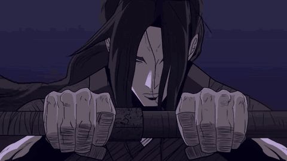
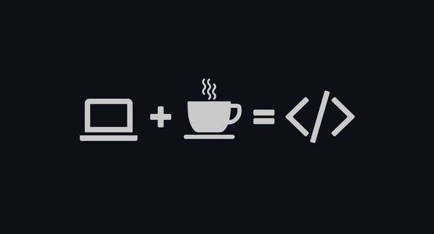

<div align="center">



<h1>PROJECT.EXE</h1>
<h3>godz3d — dreAmer who ships</h3>


</div>

<br/>

<table align="center">
<tr>
<td align="center">

```
┌──────────────────────────────┐
│ > whoami                     │
│ godz3d                       │
│                               │
│ > status                     │
│ dreaming, building, shipping  │
└──────────────────────────────┘
```

</td>
</tr>
</table>

---

## ⌁ About



I build small, real websites for real businesses — not tutorial clones.

- 🌍 Albania-based web developer
- 🧱 Comfortable with **HTML / CSS / JavaScript**, growing into **Node.js** and **React**
- 🚕 🍕 📦 Live projects: a taxi service, a pizzeria, an inventory system
- 💭 Half dreamer, half debugger — 😴💤 when not building

<br clear="right"/>

---

## ⌁ Shipped

| Project | Stack | What it does |
|:--|:--|:--|
| **[F1-Taxi](https://github.com/alboyxx21-star/F1-Taxi)** | `HTML` | Taxi/transport service site — Albania |
| **[Hydrostock](https://github.com/alboyxx21-star/Hydrostock)** | `JavaScript` | Inventory system for hydraulic parts & tools |
| **[Pizzeri-Vrapi](https://github.com/alboyxx21-star/Pizzeri-Vrapi)** | `JavaScript` | Pizzeria site, Tirana — est. 2014 |

---

## ⌁ Stack

<div align="center">


</div>

---

## ⌁ Stats

<div align="center">


</div>

<div align="center">
  
</div>

---

<div align="center">

```
while (alive) {
  dream();
  build();
  ship();
}
```

*Where two hands meet, the code begins.*

</div>
